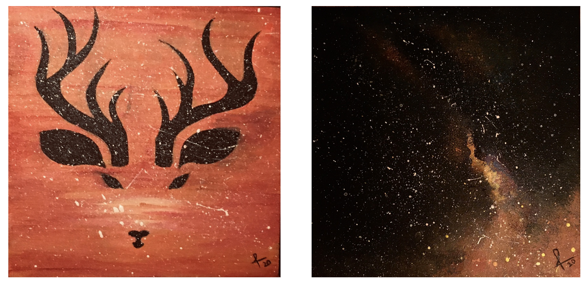
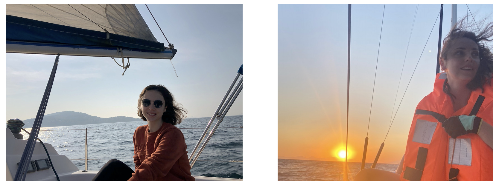

# Off-the-Clock

Life is about finding balance between work and personal passions. Here's what keeps me inspired and grounded outside of research.

  <h1 class="text-xl sm:text-2xl font-bold text-gray-600 mb-4">Painting</h1>
  

    

      
    

    

      

        Painting has been my oldest pastime (I didn't quit it after five). When I paint, I experience the feeling of being completely in the zone - where time seems to stop. I love the way colors are constructed by mixing only the primary colors.
      

      

        Here are some works I completed during my Ph.D. years.
      

    

  

<!-- Divider -->

  

  

  

  <h1 class="text-xl sm:text-2xl font-bold text-gray-600 mb-4">Sailing</h1>
  

    

      
    

    

      

        Growing up in Istanbul and Izmir, Turkey, I was surrounded by the beautiful sight of sailing boats. In fact, sailing boats have been my favorite subject to draw/paint since I was five. The opportunity to learn sailing came during my undergraduate years through the university's sailing club.
      

      

        Sailing offers the perfect escape when the wind is gentle and cooperative, but transforms into an extreme sport with heavy winds. Though I haven't had the chance to sail in the US yet, I hope to continue this passion here. For now, I try to sail during the summers in Turkey, where I can enjoy the warm weather and the sea.
      

    

  

<!-- Divider -->

  

  

  

  <h1 class="text-xl sm:text-2xl font-bold text-gray-600 mb-4">Reading</h1>
  

    

      

        Reading fiction used to be my favorite way to unwind and escape into different worlds. However, I'll admit that in recent years, the tempting "Next Episode" button on Netflix has been winning the battle for my attention, gradually replacing my reading habit with binge-watching series.
      

      

        I'm currently working on reclaiming this beloved habit and returning to the joy of turning pages rather than clicking play buttons. It's a work in progress, but every book is a step in the right direction.
      

    

    

      <a href="https://www.goodreads.com/user/show/46807974-ruya-karagulle" 
         target="_blank" 
         class="inline-flex items-center px-4 py-2 bg-orange-600 text-white rounded-lg hover:bg-orange-700 transition-colors duration-200">
        📚
        Check my Goodreads progress
      </a>
    

  

 